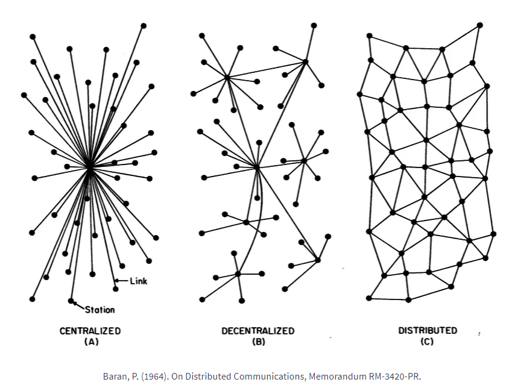

# Alternativas



```CMD
https://berty.tech/blog/decentralized-distributed-centralized/

Centralized vs Decentralized vs Distributed Systems Comparison
Now that you have a better understanding of every system, let’s see how these systems compare with one another. The following head-to-head comparison focuses on key points like fault tolerance, maintenance, scalability, development, and evolution. For each of these, we are using simple ratings like low, moderate, and high.

Centralized Systems
In a centralized system, all users are connected to a central network owner or “server”. The central owner stores data, which other users can access, and also user information. This user information may include user profiles, user-generated content, and more. A centralized system is easy to set up and can be developed quickly.
But this system has an important limitation. If the server crashes, the system no longer works properly and users cannot access the data. Because a centralized system needs a central owner to connect all the other users and devices, the availability of the network depends on this owner. Add to that the obvious security concerns that arise when one owner stores (and can access) user data, and it’s easy to understand why centralized systems are no longer the first choice for many organizations.
Pros
Simple deployment
Can be developed quickly
Affordable to maintain
Practical when data needs to be controlled centrally
Cons
Prone to failures
Higher security and privacy risks for users
Longer access times to data for users who are far from the server

Decentralized Systems
As its name implies, decentralized systems don’t have one central owner. Instead, they use multiple central owners, each of which usually stores a copy of the resources users can access.

A decentralized system can be just as vulnerable to crashes as a centralized one. However, it is by design more tolerant to faults. That’s because when one or more central owners or servers fail, the others can continue to provide data access to users.

Resources remain active if at least one of the central servers continue to operate. Usually, this means that system owners can repair faulty servers and address any other problems while the system itself continues to run as usual.

Server crashes in a decentralized system may affect the performance and limit access to some data. But in terms of overall system uptime, this system offers a big improvement over a centralized system.

Another advantage of this design is that the access time to the data is often faster. That’s because owners can create nodes in different regions or areas where user activity is high.

However, decentralized systems are still prone to the same security and privacy risks to users as centralized systems. And while their fault tolerance is higher, this comes at a price. Maintaining a decentralized system is usually more expensive.

Pros
Less likely to fail than a centralized system
Better performance
Allows for a more diverse and more flexible system
Cons
Security and privacy risks to users
Higher maintenance costs
Inconsistent performance when not properly optimized

Distributed System
A distributed system is similar to a decentralized one in that it doesn’t have a single central owner. But going a step further, it eliminates centralization. In a distributed system, users have equal access to data, though user privileges can be enabled when needed. The best example of a vast, distributed system is the internet itself.

The distributed system enables users to share ownership of the data. Hardware and software resources are also allocated between users, which in some cases may improve the performance of the system. A distributed system is safe from the independent failure of components, which can improve its uptime considerably.

Distributed systems have evolved as a result of the limitations of the other systems. With increasing security, data storage, and privacy concerns, and the constant need for improving performance, distributed systems are the natural choice for many organizations.

It’s no surprise then that technologies using the distributed system – most notably the blockchain – are changing many industries.

Pros
Fault-tolerant
Transparent and secure
Promotes resource sharing
Extremely scalable
Cons
More difficult to deploy
Higher maintenance costs
Centralized vs Decentralized vs Distributed Systems Comparison
Now that you have a better understanding of every system, let’s see how these systems compare with one another. The following head-to-head comparison focuses on key points like fault tolerance, maintenance, scalability, development, and evolution. For each of these, we are using simple ratings like low, moderate, and high.

💪 Fault tolerance:
Low: Centralized systems
Moderate: Decentralized systems
High: Distributed systems
🔧 Maintenance:
Low: Centralized systems
Moderate: Decentralized systems
High: Distributed systems
🚀 Scalability:
Low: Centralized systems
Moderate: Decentralized systems
High: Distributed systems
💰 Development:
Moderate: Decentralized systems, Distributed systems
High: Centralized systems
📈 Evolution:
Low: Centralized systems
High: Decentralized systems, Distributed systems

```

## WhatsApp

```CMD
Alternativas para o WhatsApp
```

### Berty

```CMD
https://hub.docker.com/r/bertytech/berty/tags
https://berty.tech/
https://github.com/berty/berty

License Apache 2.0
Language Go

Berty is a secure peer-to-peer messaging app that works with or without internet access, cellular data or trust in the network. With Bluetooth Low Energy (BLE), messaging doesn’t require network connection or cell coverage.
Share your details and add contacts via a QR code, public key, or an invite link. Peer-to-peer messenger with no servers, no cloud - your data is only stored on the device where Berty is installed and used
```

### Briefing

```CMD
https://brie.fi/ng
https://hub.docker.com/r/holtwick/briefing
https://github.com/holtwick/briefing/

```

### Coyim

```CMD
https://coy.im/
https://hub.docker.com/r/twstrike/coyim-ci
https://github.com/coyim/coyim

License GPL V3
Language Go
```

### Databag

```CMD
https://github.com/balzack/databag
https://hub.docker.com/r/balzack/databag/tags
```

### Ejabberd

```CMD
https://www.ejabberd.im/
https://hub.docker.com/r/ejabberd/ecs
https://github.com/processone/ejabberd

```

### Jitsi_Meet

```CMD
https://github.com/jitsi/docker-jitsi-meet
https://hub.docker.com/r/jitsi/web

```

### Kahla

```CMD
https://hub.docker.com/r/kahlan/kahlan

```

### Kontalk

```CMD
https://hub.docker.com/r/kontalk/xmppserver
https://www.kontalk.org/
https://github.com/kontalk/androidclient

License GPL V3
Language Java
```

### Lokinet

```CMD
https://hub.docker.com/r/massiveboxe/lokinet
https://github.com/oxen-io/lokinet
https://lokinet.org/

License GPL V3
Language C++
```

### Nextcloud_Talk

```CMD
https://nextcloud.com/talk/

```

### Prosody

```CMD
https://prosody.im/

```

### RocketChat

```CMD
https://www.rocket.chat/
https://hub.docker.com/_/rocket.chat

```

### SchildiChat

```CMD
https://hub.docker.com/r/tcpipuk/schildichat-web
https://github.com/SchildiChat/schildichat-desktop
https://schildi.chat/

License Apache 2.0
Language Shell
```

### Session

```CMD

https://getsession.org/
https://github.com/oxen-io/session-desktop
License GPL V3
Language TypeScript
```

### Signal

```CMD
https://hub.docker.com/r/kasmweb/signal
https://github.com/signalapp/Signal-Android
https://signal.org/

License GPL V3
Language Java
```

### Simplex

```CMD
https://hub.docker.com/r/kizaing/simplex-chat
https://simplex.chat/

```

### Skikket

```CMD
https://snikket.org/service/
https://github.com/snikket-im/snikket-server

License Apache 2.0
Language Lua
```

### Speek

```CMD
https://github.com/Speek-App/Speek
https://speek.network/

License OSL-3.0
Language C++
```

### Tox

```CMD
https://tox.chat/

```

### Wire

```CMD
https://wire.com/
https://github.com/wireapp

```
