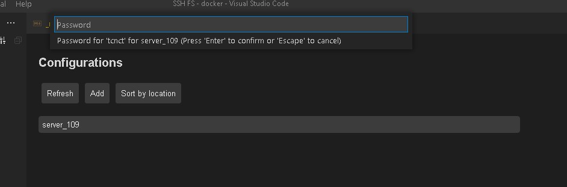

# Conectar
## Putty


https://www.chiark.greenend.org.uk/~sgtatham/putty/latest.html<br>

```
Digitar o IP, porta (normalmente a 22)
```


## VSCode
Instale a extensão SSH FS e não dependa mais de programa de FTP.





