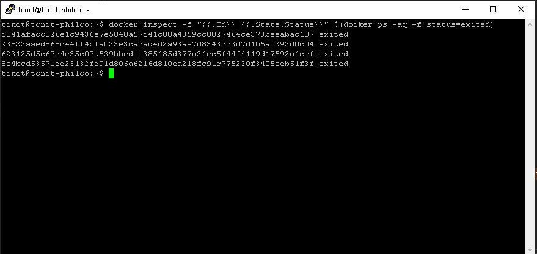

# Inspecionar

Quando acessar um servidor e quer ver quais containers existem:<br>
```
docker ps -a
```

<br>

Quando acessar um servidor e quer ver quais estão rodando:<br>
```
docker ps
```

<br>

Quando acessar um servidor e quer ver quais não estão rodando:<br>
```
docker inspect -f "{{.Id}} {{.State.Status}}" $(docker ps -aq -f status=exited)
```

<br>

Quando acessar um servidor e quer ver quais não estão rodando, com código de saída:<br>
```
docker inspect -f "{{.Id}} {{.State.Status}} {{.State.ExitCode}}" $(docker ps -aq -f status=exited)
```

<br>

Quando acessar um servidor e quer ver quais não estão rodando, com nome:<br>
```
docker inspect -f "{{.Id}} {{.State.Status}} {{.Name}}" $(docker ps -aq -f status=exited)
```

<br>

Inspecionar um único container:<br>
```
docker inspect id-do-container
```

<br>

Mostrar todos os containers que estão rodando, por ID:<br>
```
docker inspect -f "{{.Id}}" $(docker ps -q)
```

<br>

Mostrar todos os containers existentes, por ID:<br>
```
docker inspect -f "{{.Id}}" $(docker ps -aq)
```

<br>

Mostrar todos os Status dos containers existentes, por ID:<br>
```
docker inspect -f "{{.Id}} {{.State.Status}}" $(docker ps -aq)
```

<br>

Mostrar todos os Status dos containers existentes, por Nome e ID:<br>
```
docker inspect -f "{{.Name}} {{.Id}} {{.State.Status}}" $(docker ps -aq)
```

<br>


Mostrar todos os containers rodando com tabulação, por Nome, ID e Portas, Ordenando pelas Portas:<br>
```
docker ps --format "table {{.Names}}\t{{.ID}}\t{{.Ports}}" | (read -r; printf "%s\n" "$REPLY"; sort -k 3)
```

<br>

Mostrar todos os containers rodando com tabulação, por Nome, ID e Portas, Ordenando pelos Nomes:<br>
```
docker ps --format "table {{.Names}}\t{{.ID}}\t{{.Ports}}" | (read -r; printf "%s\n" "$REPLY"; sort -k 1)
```

<br>

Mostrar todos os containers rodando com tabulação, por Nome, ID e Portas, Ordenando pelos ID:<br>
```
docker ps --format "table {{.Names}}\t{{.ID}}\t{{.Ports}}" | (read -r; printf "%s\n" "$REPLY"; sort -k 2)
```

<br>

Mostrar todos os containers parados:<br>
```
docker ps -a -q -f status=exited
```

<br>

Mostrar todos os containers tabulados por id, nome, imagem, tempo de criação e tempo de execução:<br>
```
docker ps --format "table{{.ID}}\t{{.Names}}\t{{.Image}}\t{{.RunningFor}}\t{{.Status}}"
```

<br>

Mostrar formatação vertical:<br>
```
docker ps --format="\nID\t{{.ID}}\nImage\t{{.Image}}\nCommand\t{{.Command}}\nCreated\t{{.RunningFor}}\nStatus\t{{.Status}}\nPorts\t{{.Ports}}\nNames\t{{.Names}}\n"
```

<br>

Procurar pelo nome wso2:<br>
```
docker ps -a --filter "name=wso2"
```

<br>

Mostra a data de criação de todas os containers:<br>
```
docker ps -a --format "table{{.ID}}\t{{.Names}}\t{{.Status}}"
```

<br>
Pode usar também:<br>
```
Placeholder	Description
.ID	        Container ID
.Image	    Image ID
.Command	Quoted command
.CreatedAt	Time when the container was created.
.RunningFor	Elapsed time since the container was started.
.Ports	    Exposed ports.
.State	    Container status (for example; “created”, “running”, “exited”).
.Status	    Container status with details about duration and health-status.
.Size	    Container disk size.
.Names	    Container names.
.Labels	    All labels assigned to the container.
.Label	    Value of a specific label for this container. For example '{{.Label "com.docker.swarm.cpu"}}'
.Mounts	    Names of the volumes mounted in this container.
.Networks	Names of the networks attached to this container.
```

Split

[https://docs.docker.com/config/formatting/](https://docs.docker.com/config/formatting/)

Use aspas simples externamente, internamente use aspas duplas como no exemplo a seguir:<br>
Este exemplo separa o id quando encontra a letra "e".<br>
Entrada c81e8baea8<br>
Saída c81 8ba a8<br>

```CMD
docker inspect -f '{{split .Id "e"}} {{.HostConfig.RestartPolicy.Name}} {{.RestartCount}}' $(docker container ls -q)
```

Tamanho do campo<br>

```CMD
docker inspect -f '{{len .Id}} {{.HostConfig.RestartPolicy.Name}} {{.RestartCount}}' $(docker container ls -q)
```

Mostrar todos os containers parados

```CMD
docker ps -a -f status=exited
```

Ordenar pelas portas

```CMD
docker ps -a --format "table {{.ID}}\t{{.Names}}\t{{.Ports}}" | (read -r; printf "%s\n" "$REPLY"; sort -k 3 )
```

Ordenar pelos nomes

```CMD
docker ps -a --format "table {{.ID}}\t{{.Names}}\t{{.Ports}}" | (read -r; printf "%s\n" "$REPLY"; sort -k 2 )
```

Ordenar pelos ids

```CMD
docker ps -a --format "table {{.ID}}\t{{.Names}}\t{{.Ports}}" | (read -r; printf "%s\n" "$REPLY"; sort -k 1 )
```
